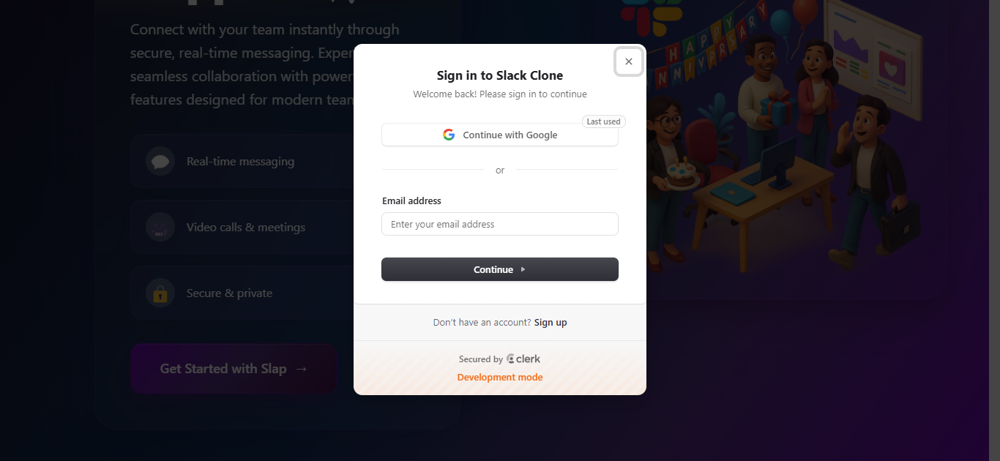
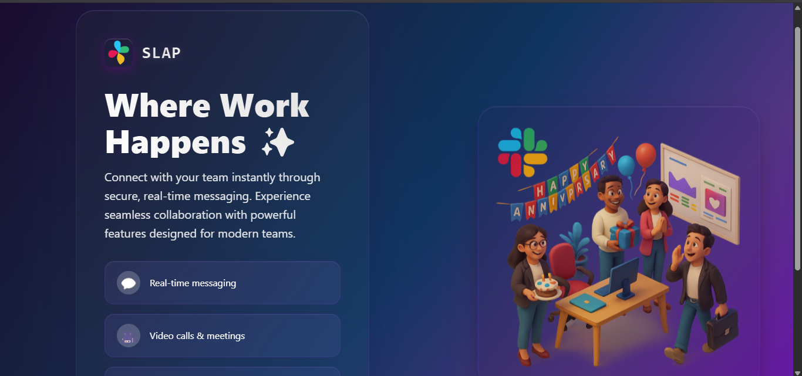
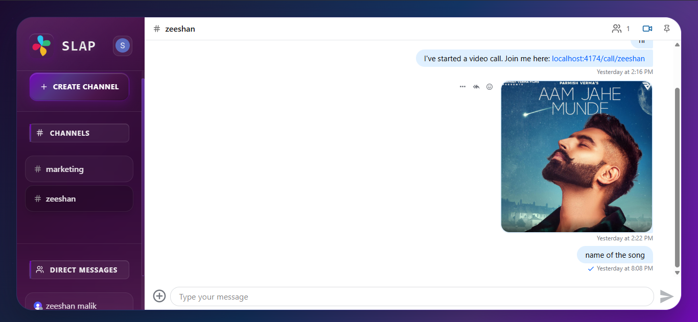
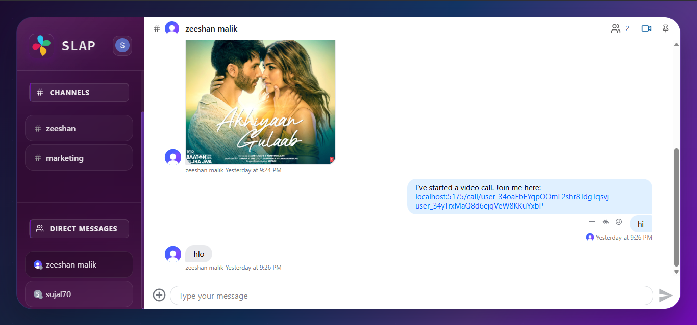
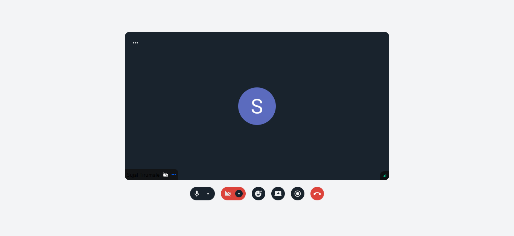

<h1 align="center">🚀 Slack Clone — Real-Time Chat & Video Calling</h1> 
 A fully-responsive real-time communication platform with Authentication, Channels, Messaging, and Group Video Calls — built solo by <b>Sujal Tirumale</b>. 

✨ Features

✅ Real-time Messaging with Stream

✅ Private & Public Channels

✅ Direct Messages

✅ File Uploads (Images, PDFs, ZIPs...)

✅ Clerk Authentication (Secure + Modern UI)

✅ Group Video Calls + Screen Share

✅ Notifications Support

✅ Admin Dashboard

✅ Background Jobs (Inngest)

✅ Production-grade Monitoring (Sentry)

🛠 Tech Stack
Category	Technology
Frontend	React, Vite, Tailwind CSS
Backend	Node.js, Express.js
Database	MongoDB
Auth	Clerk
Realtime Messaging	Stream Chat
Video Calls	Stream Video
Monitoring	Sentry
Background Jobs	Inngest

📸 Screenshots
🔐 Login & Signup (Clerk Authentication)

  

👤 User Dashboard

  

🧩 Channel Management

  

💬 Real-time Messaging

  

🎥 Video Calling + Reactions

  

🧪 Environment Setup
📌 Backend /backend/.env
PORT=5001
MONGO_URI=your_mongo_uri_here
NODE_ENV=development

CLERK_PUBLISHABLE_KEY=your_clerk_publishable_key_here
CLERK_SECRET_KEY=your_clerk_secret_key_here

STREAM_API_KEY=your_stream_api_key_here
STREAM_API_SECRET=your_stream_api_secret_here

SENTRY_DSN=your_sentry_dsn_here

INNGEST_EVENT_KEY=your_inngest_event_key_here
INNGEST_SIGNING_KEY=your_inngest_signing_key_here

CLIENT_URL=http://localhost:5173

📌 Frontend /frontend/.env
VITE_CLERK_PUBLISHABLE_KEY=your_clerk_key  
VITE_STREAM_API_KEY=your_stream_api_key  
VITE_SENTRY_DSN=your_sentry_dsn  
VITE_API_BASE_URL=http://localhost:5001/api  

🧑‍💻 Run Locally
Backend
cd backend
npm install
npm run dev

Frontend
cd frontend
npm install
npm run dev

<<<<<<< HEAD
⭐ If you like this project, please support by starring the repo!
=======
⭐ If you like this project, please support by starring the repo!
>>>>>>> main